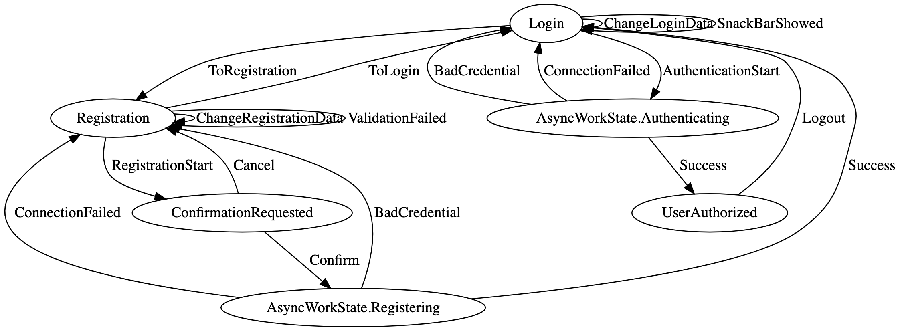
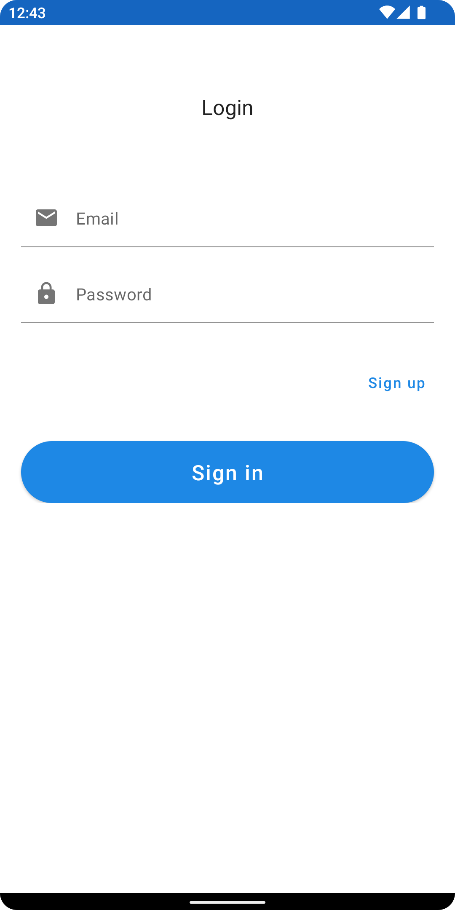
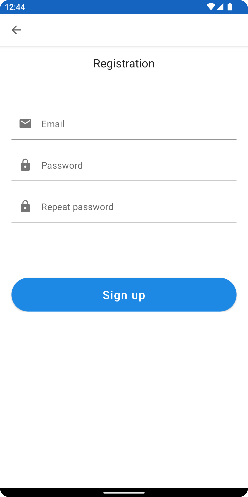
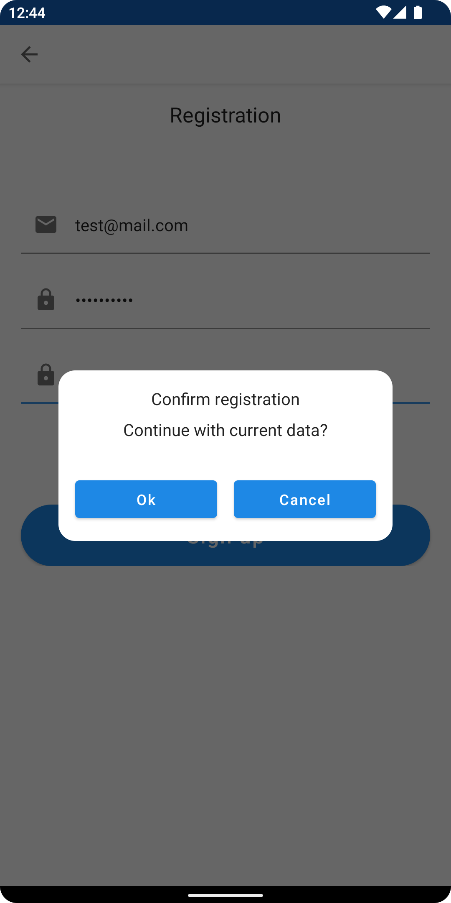
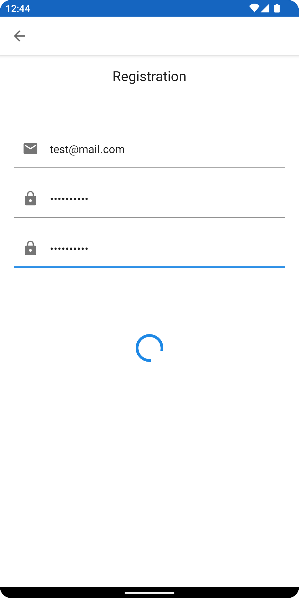
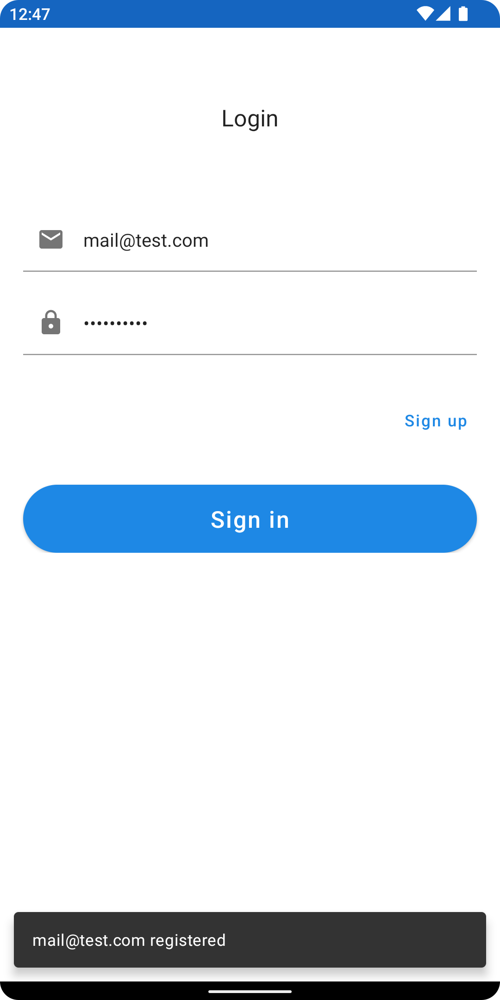
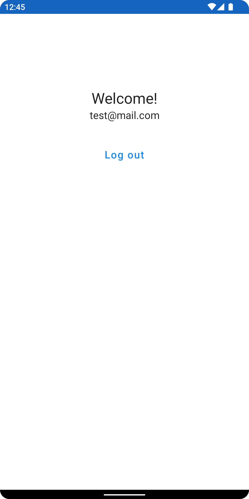

## Пример использования VisualFSM в Android приложении - Kotlin Coroutines, Jetpack Compose

[ENG](../README.md) | RUS

[VisualFSM](https://github.com/Kontur-Mobile/VisualFSM) – это Kotlin-библиотека для реализации **MVI-архитектуры**
(`Model-View-Intent`)[[1]](#что-такое-mvi) и набор инструментов для визуализации и анализа диаграммы
состояний **конечного автомата** (`Finite-state machine`, далее FSM)[[2]](#что-такое-fsm).

Визуализация происходит по исходному коду реализации FSM. Не требует написания отдельных
конфигураторов для FSM, достаточно добавлять новые классы `State` и `Action` – они автоматически
добавятся в граф состояний и переходов FSM.

Анализ исходного кода и построение графа выполняется с помощью рефлексии и реализован отдельным
модулем, что позволяет подключить его только к тестовой среде.

### Процесс авторизации и регистрации пользователя

Feature: [AuthFeature.kt](../app/src/main/java/ru/kontur/mobile/visualfsm/sample_android/feature/auth/fsm/AuthFeature.kt).

States: [AuthFSMState.kt](../app/src/main/java/ru/kontur/mobile/visualfsm/sample_android/feature/auth/fsm/AuthFSMState.kt).

Actions: [actions](../app/src/main/java/ru/kontur/mobile/visualfsm/sample_android/feature/auth/fsm/actions).

AsyncWorker: [AuthFSMAsyncWorker.kt](../app/src/main/java/ru/kontur/mobile/visualfsm/sample_android/feature/auth/fsm/AuthFSMAsyncWorker.kt).

Маппер States в модель данных Ui: [ScreenDataMapper.kt](../app/src/main/java/ru/kontur/mobile/visualfsm/sample_android/ui/auth/ScreenDataMapper.kt).

Генерация графа и пример тестов: [AuthFSMTests.kt](../app/src/test/java/ru/kontur/mobile/visualfsm/sample_android/AuthFSMTests.kt).

Для визуализации на CI используйте утилиту [graphviz](https://graphviz.org/doc/info/command.html), для визуализации на компьютере разработчика используйте [webgraphviz](http://www.webgraphviz.com/).

### Скриншоты

<table width="100%">
  <tr>
  <td width="33%">Login</td>
  <td width="33%">Registration</td>
  <td width="33%">ConfirmationRequested</td>
  </tr>
  <tr>
  <td width="33%"></td>
  <td width="33%"></td>
  <td width="33%"></td>
  </tr>
  <tr>
  <td width="33%">AsyncWorkState.Registering</td>
  <td width="33%">Login with snackbar</td>
  <td width="33%">UserAuthorized</td>
  </tr>
  <tr>
  <td width="33%"></td>
  <td width="33%"></td>
  <td width="33%"></td>
  </tr>
</table>

### Что такое MVI

`MVI` расшифровывается как **Model-View-Intent**. Это архитектурный паттерн, который следует подходу
_однонаправленный поток данных_ (_unidirectional data flow_). Данные передаются от `Model`
к `View` только в одном направлении.

[Подробнее на hannesdorfmann](http://hannesdorfmann.com/android/model-view-intent/)

### Что такое FSM

`FSM` — это абстрактная сущность, которая может находиться только в одном из конечного количества
состояний в определённый момент. Она может переходить из одного состояния в другой в ответ на
входные данные.

[Подробнее на wikipedia](https://en.wikipedia.org/wiki/Finite-state_machine)